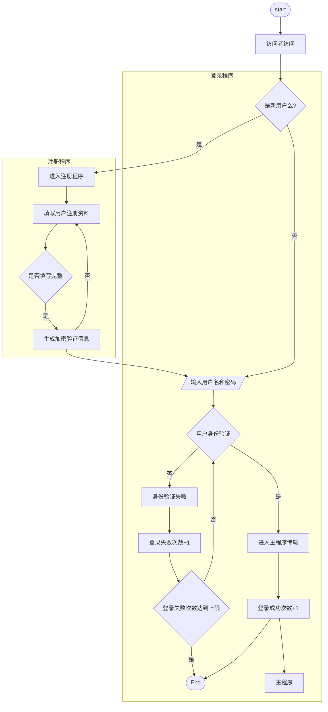
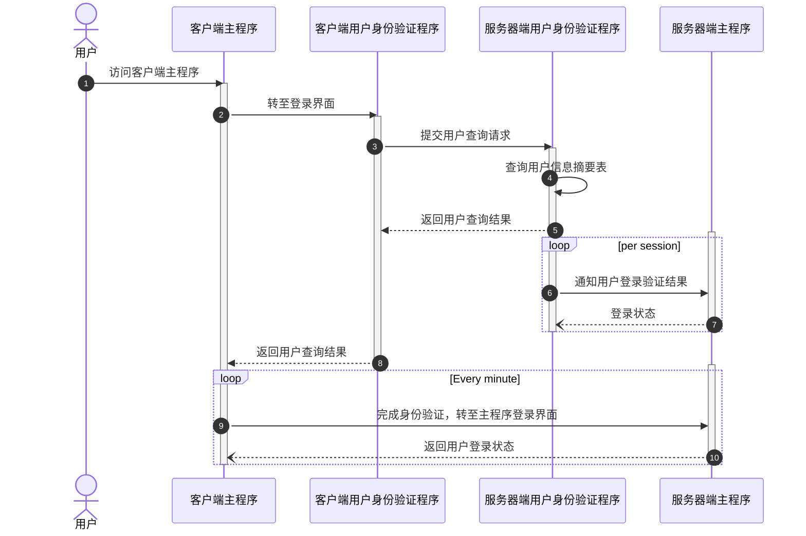

#日记 #工作 

## day planner
- [ ] 10:00 - 12:00 给新项目写需求和设计文档
## diary
### 给的新项目[User-Authenticator]写需求和设计

项目在这里：

(https://github.com/ArthurZhou/User-Authenticator)

# 用户身份验证的单独服务需求与设计
| 版本 | 修订日期      | 修订章节 | 说明 | 修订人 |
| ---- |-----------| -------- | ---- | ------ |
| v0.1 | 2022-03-09 |          | 初稿 |  |
|      |           |          |      |        |

## 需求概述
用户身份验证是互联网应用中的重要服务环节。

传统用户身份验证思路是： 

用户需要首先在注册阶段通过客户端向服务器端存储用户名和密码的记录，

其次当用户登录时，通过客户端输入用户名和密码，传递到服务器端验真后放行，如果为假则拒接访问后续行为。

这样，需要在服务器端存储用户的用户名和密码，一旦服务器端出现安全风险，则用户名和密码会被暴露，互联网历史上曾经发生过多起黑客通过技术手段将大型互联网服务系统的用户和密码数据库破解，导致大量用户数据泄露事件。

https://thehackernews.com/2017/12/data-breach-password-list.html#author-info

https://www.isccc.gov.cn/xwdt/xwkx/04/734242.shtml

另外， 多种互联网应用服务的开发中，都需要用到用户身份验证，每个项目单独开发的成本和时间会被浪费。

因此， 一套可以被不同互联网应用服务使用的，通用的，用户身份验证独立模块是可以帮助开发者简化开发工作量，提高应用服务的安全性和开发效率的。

另外， 用户的身份信息和密码信息应当尽可能的加密保存在客户端本地，减少服务器端被攻击后，用户身份信息和密码信息被大量泄漏的风险。 通过分布式存储的方式，大幅度减少恶意攻击者攻击后的收获，提高他们实施攻击的成本。

### 功能概述
用户身份验证是互联网应用程序的重要环节。

每一个用户（user）在一定的会话周期（session）中，都需要验证自己的身份。当通过用户名和密码的方式进行验证的过程中，要求：

1. 用户名和密码以特定的加密方式保存在用户客户端本地
2. 用户名和密码只能以用户客户端的授权方式访问或者修改其明文信息
3. 服务器端的应用服务只接收验证结果为真的加密信息结果，并与客户端保持一定会话周期的链接，这个通讯过程必须是某种加密通讯过程。
4. 应用服务的其他部分可以与用户身份验证部分分离，但必须也是与3.中的通讯过程一样的加密方式。
5. 用户可以独立控制自己的用户名、密码、以及密码的安全措施（比如定期修改，密码级别，加密方式等等）
6. 服务器端不能知道用户名和密码的明文信息，但是可以在一段特定的时间内保留某种信息摘要在服务器端存储，以加快用户身份验证。
7. 这个用户身份验证的服务可以跨操作系统使用

### 使用场景
在web 应用中，开发者A设计并开发了一套应用程序，用于网络间的文件交换和管理， 当使用这个应用程序时，需要先从客户端登录，并确认身份。

开发者A可以通过调用用户身份验证的单独模块，直接使用，无需再次开发相应的功能。

### 系统输入和输出
客户端输入：

*无*

客户端输出：

*'True','False'*

服务器端输入：

*无*

服务器端输出：

*'True','False,'NEWACCOUNT | (新注册的用户哈希值)'*

### 系统约束
加密算法在客户端的计算效率

网络通讯延迟

开发者能力

## 功能需求细节
### 主流程

	

用户访问流程

修改流程

删除流程

### 输入特征
明文输入复杂度

本地加密

本地时间

本地加盐

### 加密算法模型
*！已修改为SHA256*

考虑到前期开发难度和能力，建议使用简单的算法，可以使用[[MD5 |MD5信息摘要算法]]

后期提高安全性，建议使用国密算法 SM3 或者[[SHA256 |SHA-256算法]]

但是需要设计成支持用户对不同加密算法的主动选择。

### 输出结果评价
用户ID

加密算法种类

算法结果（第一个结果，在客户端）

匹配结果（第二个结果，在服务器端）

客户端操作时间

客户端算法结果输出时间

服务器端匹配结果输出时间

算法计算在客户端消耗时间

## 设计概述

### 整体架构

### 数据结构定义

### 流程和序列图

### 性能

### 安全性

### 兼容性

### 开发环境
Python 3.7。2

### 测试方案

## 版本规划和开发时间

## 风险评估
1. MD5 信息摘要算法的安全隐患，已知具有被碰撞的可能https://www.view.sdu.edu.cn/info/1003/11424.htm
2. Python提供的算法包安全隐患
3. HTTPS协议的安全隐患
4. 
